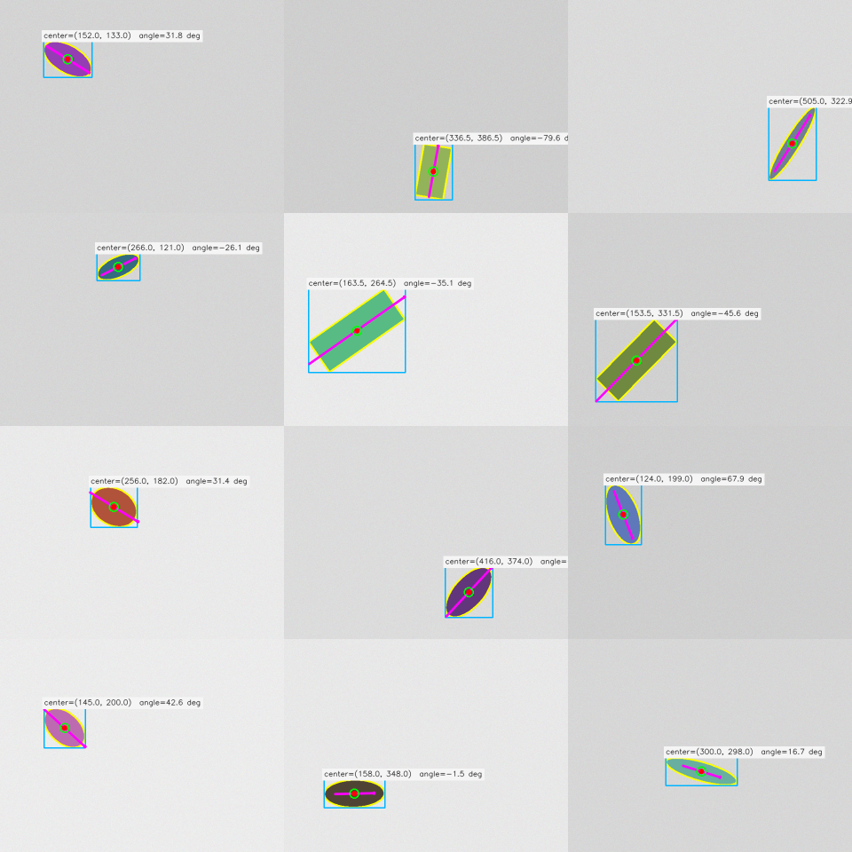
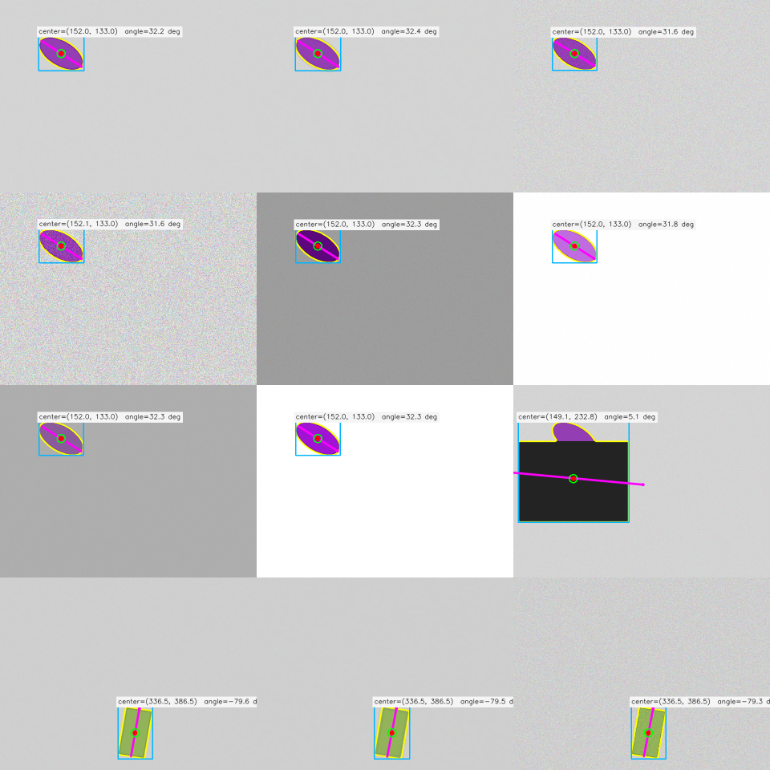
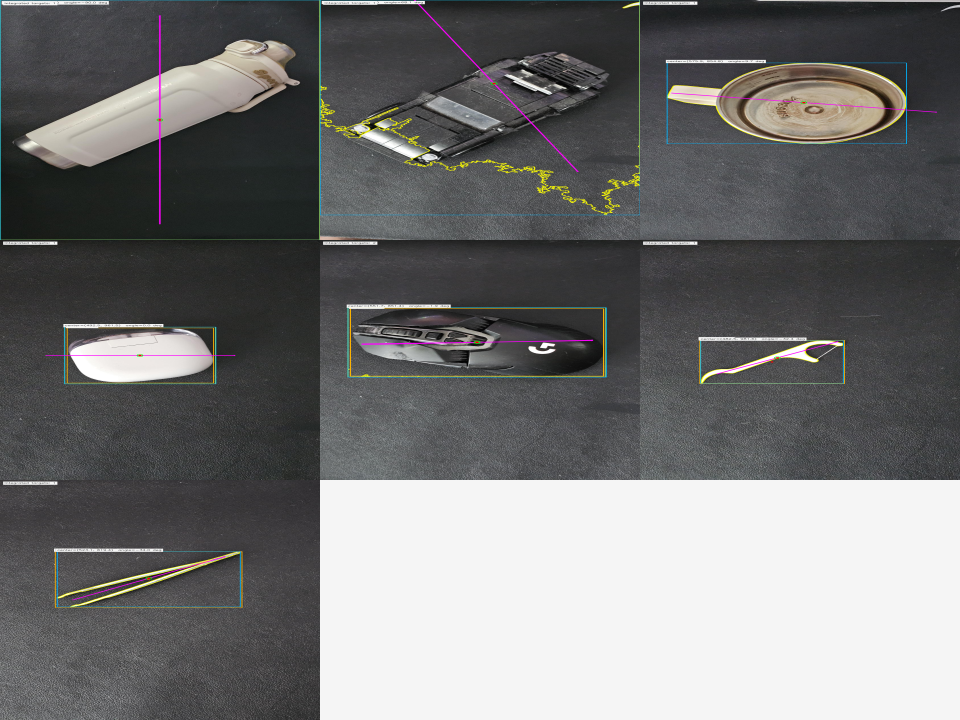

# Vision-Based Pick-Point Estimation for Robotic Manipulation

A practical computer-vision portfolio project for estimating 2D object pick points and orientations from RGB images.

Repository name: `robotic-pickpoint-vision`

## Recruiter summary

This project demonstrates a robotics-style perception pipeline without requiring a robot arm, depth camera, depth sensor, or external hardware.

The system can:

- generate synthetic pick-object scenes with ground-truth labels
- estimate object center and orientation using OpenCV contours, PCA, and `minAreaRect`
- evaluate center-point error, orientation error, pass rates, and inference speed
- stress-test the pipeline under blur, noise, brightness, contrast, and occlusion
- run YOLO object detection as an optional front end
- tune YOLO inference with confidence, image size, IoU, augmentation, class filters, max detections, and CPU/CUDA device selection
- combine YOLO detections with OpenCV segmentation and geometric pose estimation
- fall back to OpenCV object segmentation when YOLO is not useful
- improve real-image masks using local-background segmentation
- interactively tune contours in Streamlit and immediately see how mask quality affects pick point and orientation
- export annotated images, CSV results, JSON summaries, and evaluation reports

This repository is intended to show practical computer vision, robotics perception thinking, measurable evaluation, robustness testing, failure-case analysis, interactive debugging tools, and clean Python software engineering.

---

## Demo preview

| Synthetic pose estimation | Robustness evaluation | Integrated pick-point pipeline |
|---|---|---|
|  |  |  |

To regenerate these demo assets locally, run:

```powershell
py scripts\export_demo_assets.py
```

The exported images are saved under:

```text
docs/assets/
```

---

## Why this project is useful

Robotic pick-point estimation is more than drawing a bounding box around an object. A robot-style perception system also needs to estimate where to grasp, how the object is oriented, and when the result may be unreliable.

This project demonstrates that full workflow:

| Capability | Why it matters |
|---|---|
| Synthetic data generation | Provides controlled scenes with ground truth for measurable evaluation |
| OpenCV pose estimation | Shows classical geometry-based computer vision skills |
| YOLO detection | Adds a modern learned detector for real RGB images |
| Local-background segmentation | Improves object masks when the YOLO box alone is not enough |
| Robustness evaluation | Measures behavior under blur, noise, lighting changes, and occlusion |
| Live contour tuning | Makes failure cases explainable and lets the user inspect how mask quality affects pose |
| Streamlit GUI | Turns the project into a practical, demo-ready application |
| CUDA diagnostics | Shows awareness of deployment and GPU acceleration issues |
| Tests and reports | Makes the repository easier to review, reproduce, and trust |

---

## Pipeline overview

```text
Input RGB image
   |
   |-- Optional YOLO detection
   |       |
   |       └── object bounding boxes
   |
   |-- OpenCV segmentation
   |       |
   |       ├── local-background foreground mask
   |       └── optional live contour tuning in Streamlit
   |
   |-- Contour extraction
   |       |
   |       ├── center estimation
   |       ├── orientation estimation
   |       └── pick-point recommendation
   |
   └── annotated output + CSV/JSON metrics
```

The project supports three complementary perception workflows:

1. **Synthetic/evaluation path**  
   Uses generated masks and labels to measure accuracy against known ground truth.

2. **Real-image automatic path**  
   Uses YOLO when available and falls back to OpenCV segmentation when YOLO does not find a usable object.

3. **Live contour-tuning path**  
   Lets the user interactively adjust the segmentation mask and immediately rerun contour-based pose estimation without rerunning the full YOLO pipeline.

---

## Key features

- Synthetic rotated-object dataset generation
- Ground-truth labels in CSV and JSON
- OpenCV contour-based center estimation
- PCA-based orientation estimation
- `minAreaRect` orientation baseline
- Real-image local-background segmentation
- Interactive contour tuning for real images
- Streamlit debug views for:
  - original image
  - local-background distance image
  - tuned binary mask
  - final contour, orientation, and pick point
- YOLO detection path using Ultralytics
- YOLO inference controls:
  - confidence threshold
  - image size
  - IoU threshold
  - test-time augmentation
  - class filtering
  - maximum detections
  - CPU/CUDA device selection
- CUDA setup diagnostic script
- Integrated YOLO + OpenCV pick-point pipeline
- Streamlit GUI with automatic and live-tuning workflows
- Annotated image saving
- CSV, JSON, and Markdown reports
- Robustness tests for:
  - blur
  - noise
  - brightness
  - contrast
  - partial occlusion
- Failure-case analysis and documented limitations
- Unit tests for core modules

---

## Setup

Create and activate a virtual environment:

```powershell
py -m venv .venv
.\.venv\Scripts\activate
```

Install the project:

```powershell
py -m pip install --upgrade pip
py -m pip install -e .
```

For YOLO support:

```powershell
py -m pip install ultralytics
```

### Optional CUDA support

The project runs on CPU, but YOLO inference is faster with CUDA-enabled PyTorch.

Check your CUDA/PyTorch setup:

```powershell
py scripts\check_cuda_setup.py
```

If PyTorch reports `torch.cuda.is_available(): False`, install CUDA-enabled PyTorch using the official PyTorch selector:

```text
https://pytorch.org/get-started/locally/
```

Then verify again:

```powershell
py scripts\check_cuda_setup.py
```

When CUDA is available, YOLO commands using `--device auto` should resolve to GPU device `0`.

---

## Quick start

Run the synthetic demo:

```powershell
py scripts\run_demo.py --regenerate
```

Open:

```text
outputs/annotated/demo/demo_grid.png
```

Run the Streamlit app:

```powershell
streamlit run app\streamlit_app.py
```

Run all tests:

```powershell
py -m pytest
```

---

## Main commands

### Generate synthetic dataset

```powershell
py scripts\create_synthetic_dataset.py --num-images 20 --clear
```

Outputs:

```text
data/synthetic/images/
data/synthetic/masks/
data/synthetic/labels.csv
data/synthetic/labels.json
data/synthetic/preview_grid.png
```

### Run synthetic pose-estimation demo

```powershell
py scripts\run_demo.py --regenerate
```

Outputs:

```text
outputs/annotated/demo/demo_grid.png
outputs/metrics/demo_summary.json
```

### Run evaluation

```powershell
py scripts\evaluate.py
```

Outputs:

```text
outputs/metrics/evaluation/per_sample_metrics.csv
outputs/metrics/evaluation/evaluation_summary.json
outputs/metrics/evaluation/evaluation_report.md
```

### Run robustness evaluation

```powershell
py scripts\create_robustness_variants.py --clear
py scripts\evaluate_robustness.py
```

Outputs:

```text
outputs/robustness/step7/
outputs/metrics/robustness/per_variant_metrics.csv
outputs/metrics/robustness/robustness_summary.json
outputs/metrics/robustness/robustness_report.md
outputs/metrics/robustness/robustness_evaluation_grid.png
```

### Run YOLO detection

Default detection:

```powershell
py scripts\run_yolo_detection.py --input-dir data\sample_images --device auto
```

More sensitive detection for difficult tabletop images:

```powershell
py scripts\run_yolo_detection.py --input-dir data\sample_images --model yolov8s.pt --confidence 0.10 --img-size 1280 --augment --device auto
```

Outputs:

```text
outputs/annotated/yolo/yolo_detection_grid.png
outputs/metrics/yolo_detections.csv
```

### Run integrated pick-point pipeline

For real images:

```powershell
py scripts\run_integrated_pipeline.py --input-dir data\sample_images --device auto
```

For a more sensitive YOLO + OpenCV run:

```powershell
py scripts\run_integrated_pipeline.py --input-dir data\sample_images --model yolov8s.pt --confidence 0.10 --img-size 1280 --augment --device auto
```

For deterministic OpenCV-only testing on synthetic images:

```powershell
py scripts\run_integrated_pipeline.py --input-dir data\synthetic\images --no-yolo --max-images 5
```

Outputs:

```text
outputs/annotated/integrated/integrated_pickpoint_grid.png
outputs/metrics/integrated_pickpoints.csv
outputs/metrics/integrated_pickpoints.json
```

### Run Streamlit app

```powershell
streamlit run app\streamlit_app.py
```

The app supports:

- image upload
- automatic YOLO + OpenCV fallback mode
- OpenCV-only mode
- live contour tuning mode
- YOLO model selection
- YOLO confidence threshold
- YOLO image size
- YOLO IoU threshold
- YOLO test-time augmentation
- optional YOLO class filter
- maximum detections
- CPU/CUDA device selection
- image display-width control
- annotated image download
- result CSV download

---

## Streamlit workflows

The Streamlit app is designed for both simple demos and deeper computer-vision debugging.

### Automatic pipeline

The automatic workflow runs the full perception stack:

```text
image upload -> optional YOLO detection -> OpenCV segmentation -> contour pose estimation -> annotated result
```

This is useful for a quick recruiter demo because the user can upload an image and immediately see a pick point, orientation axis, object contour, and result table.

### Live contour tuning

The live contour tuning workflow lets the user adjust the segmentation mask interactively. Slider changes rerun the lightweight OpenCV contour step immediately.

Available tuning controls:

| Control | Why it is useful |
|---|---|
| Foreground sensitivity | Includes more or fewer pixels in the object mask |
| Blur size | Reduces noise before thresholding |
| Open kernel | Removes small false foreground speckles |
| Close kernel | Fills holes and gaps inside the object mask |
| Erode iterations | Shrinks an overly large mask |
| Dilate iterations | Expands an overly small mask |
| Minimum contour area | Filters tiny false contours |
| Contour smoothing | Reduces jagged contour boundaries |
| Invert mask | Helps when the background is selected instead of the object |

The live view displays:

```text
Original image
Local background distance image
Tuned binary mask
Final contour + pick point
```

This is useful because real-world perception often fails because of imperfect segmentation, not because of the pose-estimation math. The live tuning view makes that relationship visible and helps explain how the mask affects center, orientation, contour area, and pick-point quality.

---

## Results

### Synthetic clean-mask baseline

On the default synthetic dataset, the mask-based baseline typically achieves:

| Metric | Result |
|---|---:|
| Mean center error | 0.334 px |
| Max center error | 0.805 px |
| Mean PCA orientation error | 0.832 deg |
| P90 PCA orientation error | 2.166 deg |
| Mean `minAreaRect` orientation error | 2.776 deg |
| Center pass rate at 2 px | 100% |
| Orientation pass rate at 5 deg | 100% |

### Robustness evaluation

The image-based OpenCV path is robust to blur, brightness, contrast, and noise on the synthetic scenes. Partial occlusion is the dominant failure case.

| Transform | Observation |
|---|---|
| Blur | Stable center and orientation estimation |
| Noise | Stable after morphology cleanup |
| Brightness | Stable when foreground/background contrast remains usable |
| Contrast | Stable unless foreground/background separation becomes weak |
| Occlusion | Large center and orientation errors can occur |

### Real-image integrated pipeline

The real-image integrated pipeline is a demonstration of learned detection plus classical geometric pose estimation. It can estimate pick points on user-provided images, but result quality depends on segmentation quality, object/background contrast, and whether YOLO produces a useful detection.

Observed limitations:

- Off-the-shelf YOLO may miss unusual objects or assign imperfect COCO classes.
- Full-image OpenCV fallback can include background when object and background are visually similar.
- Thin, reflective, transparent, or dark-on-dark objects can produce unstable contours.
- Symmetric objects can have ambiguous orientation.
- Partial occlusion can shift the estimated center and orientation.
- Live contour tuning can improve the final mask, but it is an interactive debugging aid rather than a replacement for a domain-trained detector.

These limitations are documented intentionally because practical perception projects should show both successful cases and failure cases.

---

## Testing

Run:

```powershell
py -m pytest
```

The test suite covers synthetic data generation, pose estimation, visualization, evaluation, robustness transformations, segmentation, contour tuning, YOLO detection utilities, integrated pipeline behavior, Streamlit helpers, and CUDA device resolution.

---

## Project structure

```text
robotic-pickpoint-vision/
├── README.md
├── requirements.txt
├── pyproject.toml
├── .gitignore
├── src/
│   └── pickpoint_vision/
│       ├── app_utils.py
│       ├── contour_tuning.py
│       ├── detection.py
│       ├── evaluation.py
│       ├── integrated_pipeline.py
│       ├── pipeline.py
│       ├── pose_estimation.py
│       ├── real_segmentation.py
│       ├── robustness.py
│       ├── robustness_evaluation.py
│       ├── segmentation.py
│       ├── synthetic_data.py
│       ├── utils.py
│       └── visualization.py
├── app/
│   └── streamlit_app.py
├── scripts/
│   ├── check_cuda_setup.py
│   ├── create_synthetic_dataset.py
│   ├── create_robustness_variants.py
│   ├── evaluate.py
│   ├── evaluate_robustness.py
│   ├── export_demo_assets.py
│   ├── run_demo.py
│   ├── run_integrated_pipeline.py
│   ├── run_pose_estimation.py
│   ├── run_yolo_detection.py
│   └── visualize_synthetic_results.py
├── tests/
├── data/
├── outputs/
└── docs/
```

---

## What this project demonstrates

- Practical image-processing pipeline design
- OpenCV contour and PCA pose estimation
- Real-image segmentation from local background contrast
- Interactive contour tuning and visual debugging
- Synthetic data generation with known labels
- Quantitative evaluation rather than only visual demos
- Robustness testing and failure-case analysis
- YOLO integration and inference tuning
- CUDA/CPU deployment awareness
- Streamlit app development
- Clean Python packaging and tests
- GitHub-ready documentation

---

## Future improvements

- Train a custom detector on industrial pick objects
- Add YOLO segmentation or SAM-style masks
- Add object-specific pick-point rules
- Add save/load presets for contour-tuning settings
- Improve orientation confidence scoring
- Add multiple-object pick ranking
- Add automatic failure-case ranking
- Export ONNX models for deployment-style demos
- Add optional depth simulation from monocular cues or synthetic data

---

## License

Add a license before publishing if you want others to reuse this code.
